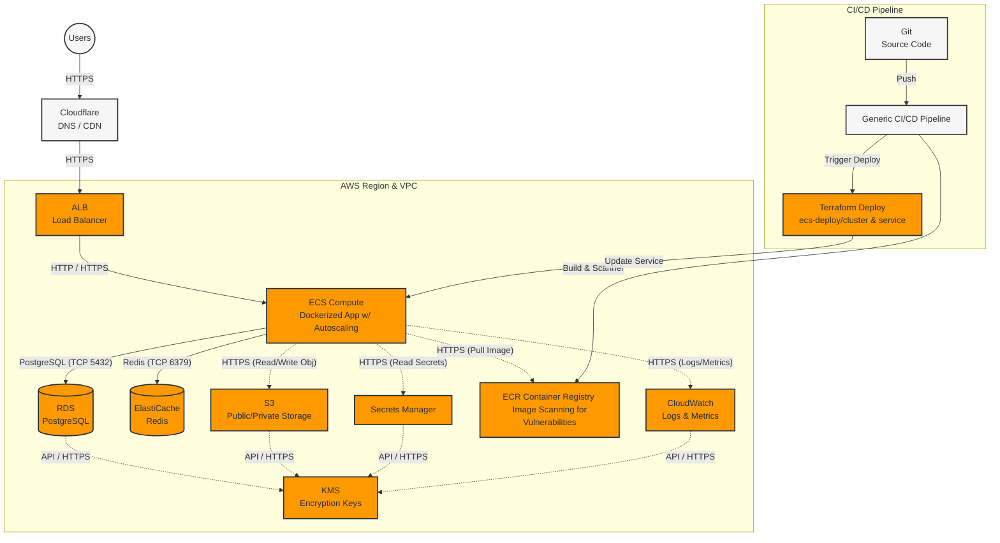
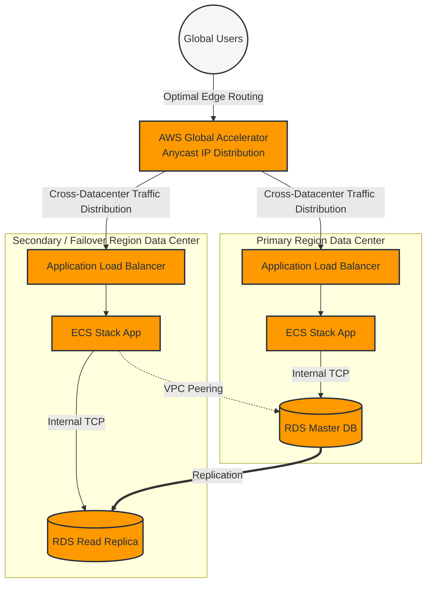
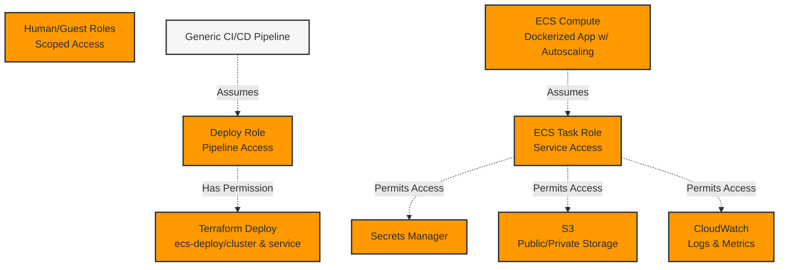
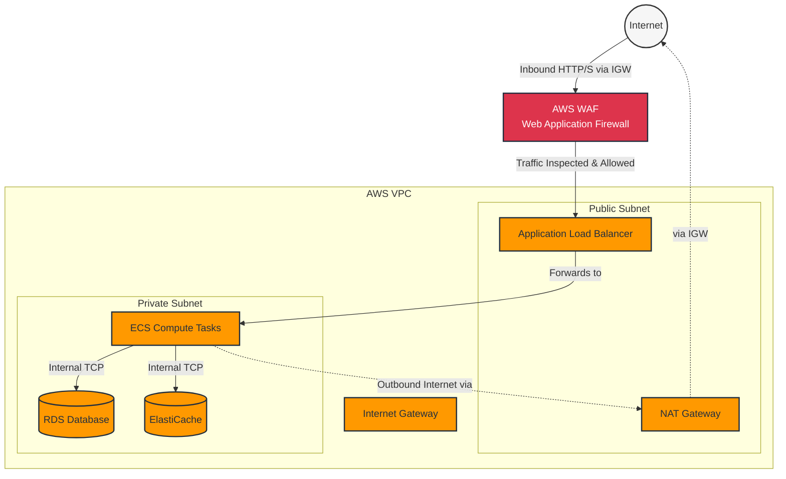
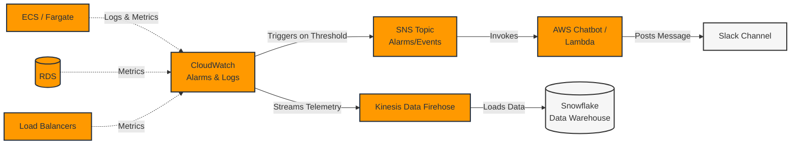
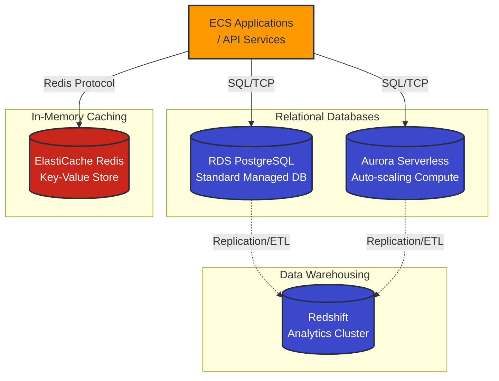

# AWS Architecture

The [`aws/stack`](./stack/README.md) is one such module in this repository that serves as an example of how these modules can be combined. It combines the resources one needs for a standard app that uses a postgres DB, redis, and runs a dockerized app in ECS.

## Global Distribution & VPC Peering

The stack infrastructure is multi-data-center ready. By leveraging the `global-accelerator` and `vpc-peering` modules alongside multiple stack deployments, cross-datacenter traffic distribution and geographic failover can be effortlessly achieved.

Have a look at the [multi-stack](./multi-stack/README.md) module for an example implementation of the Global Distribution setup.

## IAM Access Control

We utilize role-based access with only the minimum necessary privileges.

## Network Topology & Security

The environment generates a VPC containing isolated subnets. Incoming internet traffic is filtered by **AWS WAF (Web Application Firewall)** to block malicious requests before they pass through the Load Balancer. Private resources like ECS tasks and Databases are placed in Private subnets with zero direct inbound internet access. Outbound traffic from the private subnet routes through an optional NAT Gateway.

## Monitoring & Alerting Flow

Comprehensive observability is integrated throughout the stack. Components push logs and metrics to CloudWatch, where thresholds and alarms trigger SNS Topics. These topics forward critical alerts via AWS Chatbot or Lambda directly into Slack.

We also integrate `cloudwatch-kinesis` and `cloudwatch-snowflake` to push telemetry data out of CloudWatch and into Snowflake for ultra-fast querying of metrics.

## Data & Database Services

We support a variety of data stores depending on the application's consistency, compute, and caching needs.

*   **Amazon Aurora**: For high-performance, auto-scaling relational database workloads (serverless compute & storage).
*   **Amazon RDS (PostgreSQL)**: The standard managed relational database.
*   **Amazon ElastiCache (Redis)**: Fully managed, in-memory caching service for fast data retrieval.
*   **Amazon Redshift**: Highly scalable data warehouse optimized for analytics.

